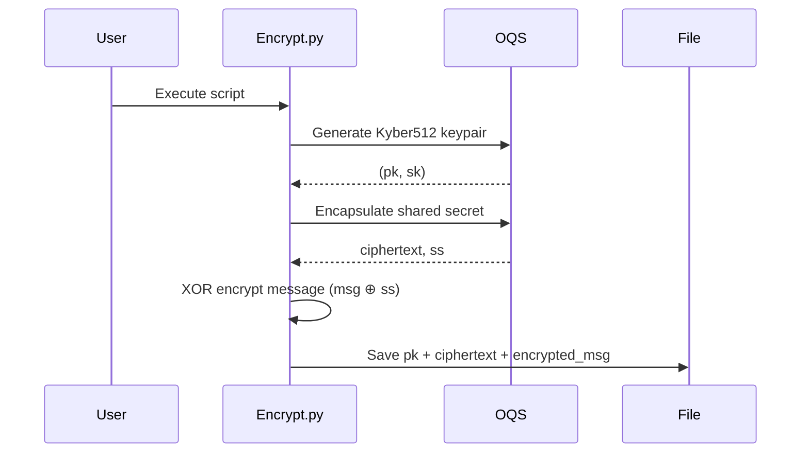
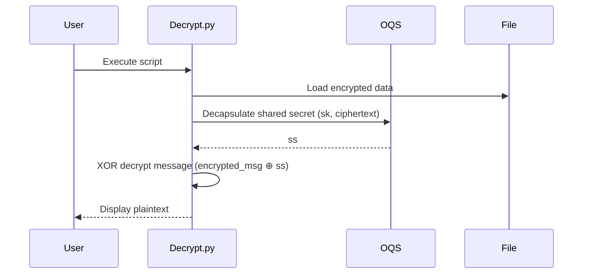

# 🔐 KyberCryptor [](LICENSE)

Quantum-resistant encryption tool implementing Kyber512 (NIST-standardized PQC algorithm) with hybrid encryption capabilities.

> [!WARNING]
> Developed for educational/research purposes only. Not recommended for production use or sensitive data protection.


## 🌟 Features

- **Post-Quantum Secure**: Implements Kyber512 (NIST PQC Finalist)
- **Hybrid Encryption**: Combines Kyber KEM with XOR symmetric encryption
- **Simple CLI Interface**: Easy encrypt/decrypt workflows
- **Cross-Platform**: Supports Linux, macOS, and Windows*
- **Lightweight**: Minimal dependencies with Python 3.8+ compatibility

*Windows requires manual liboqs compilation


## 📋 Prerequisites
- Python 3.8+
- Open Quantum Safe Library (liboqs)
- Python `oqs` bindings


## 🚀 Quick Start

### 1. Clone Repository
```bash
git clone https://github.com/odaysec/kybercryptor.git
cd kybercryptor
```

### 2. Setup Virtual Environment
```bash
python3 -m venv venv
source venv/bin/activate  # Windows: venv\Scripts\activate
```

### 3. Install Dependencies
```bash
# Install OQS Python bindings
pip install oqs
```


## 🛠 Usage Guide Encrypt Message
1. Edit `encrypt.py` to modify default message ("Kyber")
2. Run encryption:
```bash
python encrypt.py
```
Generates:
- `kyber_encrypted.dat` (encrypted payload)
- Keypair and shared secret

### 🔓 Decrypt Message
```bash
python decrypt.py
```
Outputs decrypted message to console

## 📂 File Structure
```
kybercryptor/
├── encrypt.py          # Encryption workflow
├── decrypt.py          # Decryption workflow
├── utils.py            # XOR encryption helpers
├── requirements.txt   # Dependency list
├── LICENSE            # MIT License
└── examples/          # Usage examples (future)
```


## 💻 Example Session
```bash
# Encryption
$ python encrypt.py
Successfully encrypted message to kyber_encrypted.dat

# Decryption 
$ python decrypt.py
Decrypted message: Kyber
```
## 🔄 Process Flow

### Encryption Workflow


### Decryption Workflow



## 📚 Documentation Hybrid Encryption Workflow
1. Kyber512 generates public/private keypair
2. Shared secret established via KEM
3. XOR cipher encrypts payload using shared secret
4. Encrypted data stored with public key


## 📜 License
MIT Licensed - See [LICENSE](LICENSE) for details.
